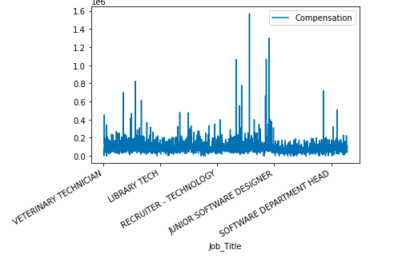
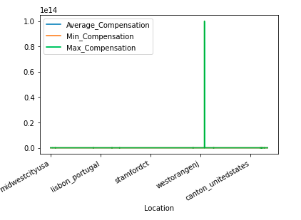
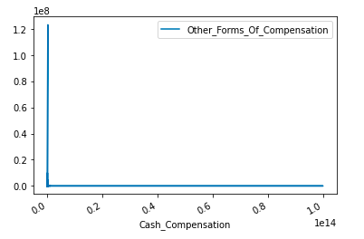
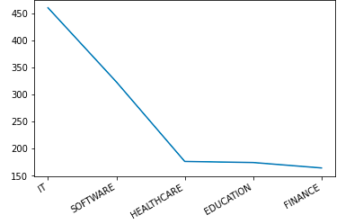
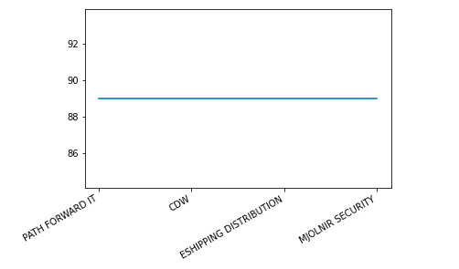

# PF_Data_Cleansing_Project

```
Framework: PySpark 

IDE: Intellij 

PREFERRED IDEs : Intellij, PyCharm
```

Below are the **assumptions** made while cleaning these datasets:  
    
    # Handled NULL values with 0 for numeric columns, blank for string columns as default values.
    # Removed extra characters like $,_,/ and so on from the column values.
    # Capitalized data values for almost all the string columns except the location column.
    # Converted the amount-related columns to double/float format. Discarded the records that are alphanumeric.
    # Removed leading / Trailing spaces from the column values.
    # Segregated the columns where the data is present in form of ranges for eg: Work_Experience in order to make the further aggregation computations easier.
    # Converted columns to their respective data types at the end because if the casting is successful then it would mean that the column records have been cleaned as per their expected data types or else it will throw an error if some value is not able to convert it to the asked data type.
    # These use cases were totally solved based on my assumptions and understanding.   
    # Based on the assumptions for amount related columns, discarded the records that don't match the criteria which would be sent back to the client for auditing.

##### **NULL VALUES**: In the actual scenario would have confirmed from the client what to do with these "null" values. Whether they want it to be replaced/eliminate/ keep some default values for it. The same as I did here.

**PROJECT FLOW:**

1. _Invoker.py_ is the main class.
2. It will call the other classes and the methods will be executed accordingly.
3. _Data_1.py_ has the logic for cleaning and transforming data as per the use case.
4. _Data_2.py_ has the logic for cleaning and transforming data as per the use case.
5. _Data_3.py_ has the logic for cleaning and transforming data as per the use case.
6. _Aggregations.py_ has the transformation logic for the 3 problem statements and the 2 additional problem statements of me as below: 
     1) List the top 5 industries under which people are much happier.
     2) Which 4 companies work a lot per week?

**CHALLENGES:**
1) This was my first time with Visualization. Therefore, starting with the MatplotLib library of pandas to showcase the data in form of Graph and Histograms.
2) _Problem Statement 3_ was vague. Therefore, made my own assumptions and solved it.
3) Cleansing of data is always a challenge and every data engineer faces in their day-to-day life. 
4) Solving this problem within the given timeframe is again a huge challenge.


**HOW TO RUN THIS FRAMEWORK?**

1) Take a git pull of this project. If unable to clone then download this project as a zip file and then unzip and import in your IDE.
2) You can also directly create a new project from the version control option under file menu in IDE. Provide the link and import the project.
3) Right-click on the project > module settings > modules > add content root > locate python folder from your unzipped spark folder and click on apply.
4) Replace the files' path under Invoker.py file.
5) You are ready to go. Run the invoker class and see the magic.


**SCREENSHOTS:**

1) _Problem Statement 1:_



3) _Problem Statement 2_:



4) _Problem Statement 3_:  



5) _Problem Statement 4_:



5) _Problem Statement 5_:



